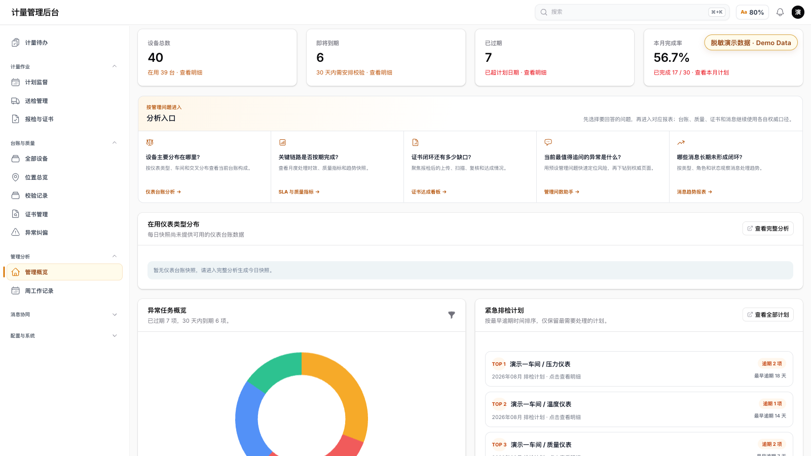
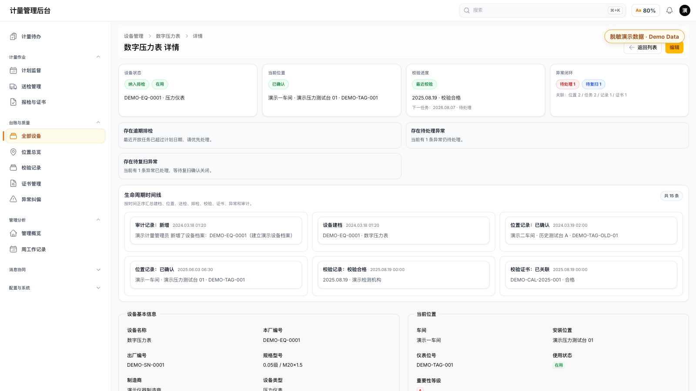
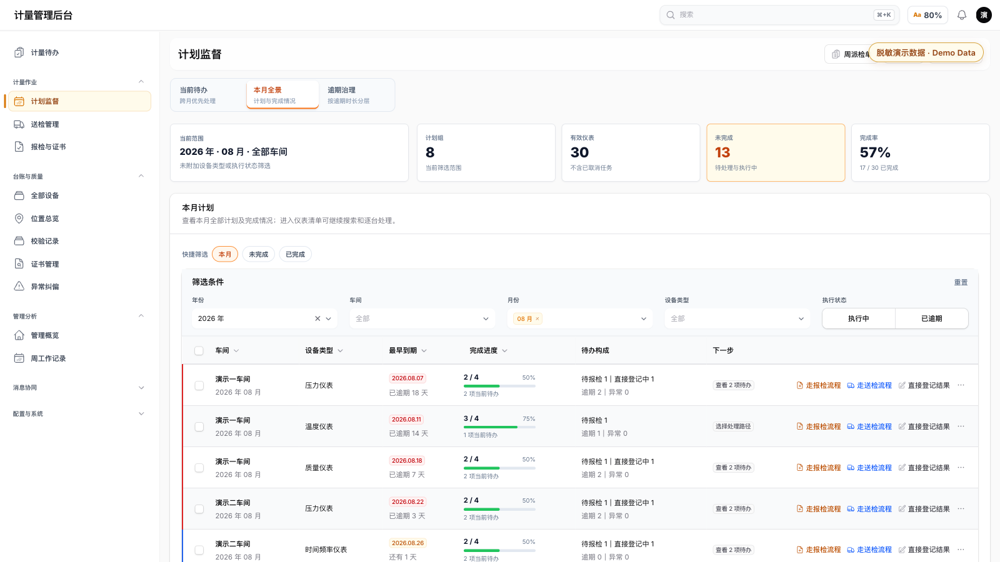
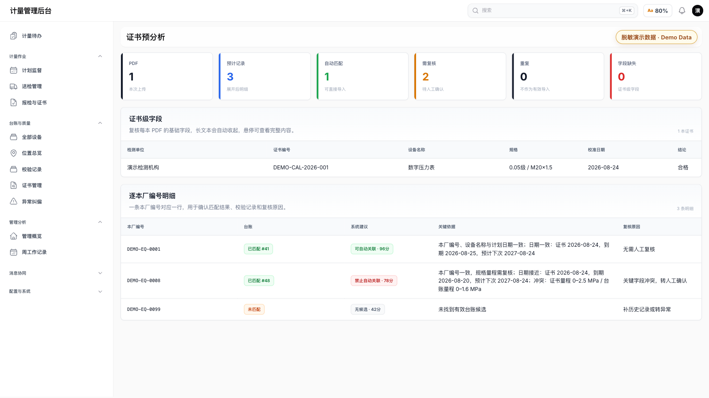
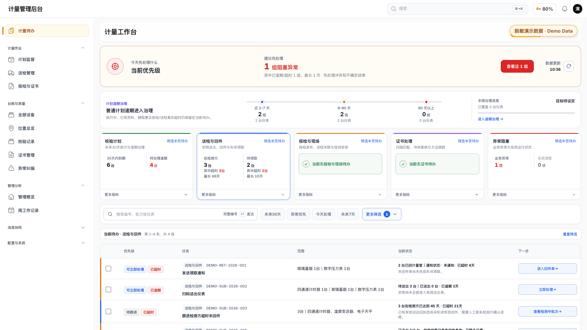
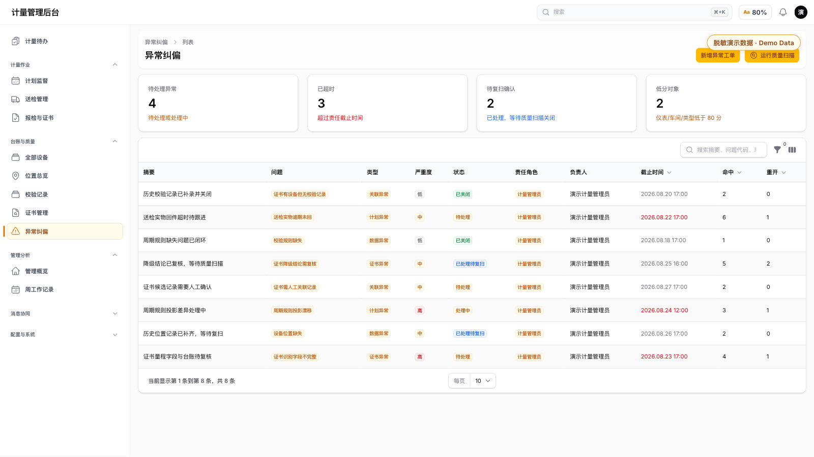
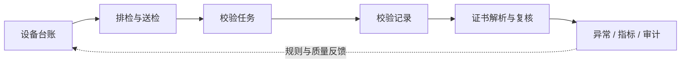

# 计量设备与校验协同系统｜Measurement Portfolio

[](https://github.com/MrPerfume/measurement-portfolio/actions/workflows/verify.yml)

> 一个可公开审阅、可本地运行的计量设备与校验协同领域内核，展示业务建模、状态守卫、可解释匹配、幂等处理、部分回件与审计思维。

- **项目场景**：计量设备台账、校准计划、证书及异常协同。
- **个人职责**：独立完成需求梳理、流程设计、领域建模和系统开发。
- **当前状态**：测试/演示阶段，小范围试用已安排；未正式上线，不宣称生产成效。

## 30 秒看懂

- **业务判断**：从真实实物交接出发处理计划外送检，不要求现场先补齐并不存在的需求单。
- **可靠性设计**：用事务、幂等、并发约束和通知结果分级保护跨角色、跨步骤的业务事实。
- **现场价值**：按真实送出轮次形成检测方在检视图，让异常设备单独留证、正常设备继续流转。
- **可审阅证据**：既可以查看界面覆盖面，也可以继续核对[代表案例](#代表案例计划外送检与检测方在检协同)、[核心业务流程](docs/BUSINESS_FLOWS.md)和[工程证据](docs/ENGINEERING_EVIDENCE.md)。

## 系统展示

> 以下界面全部使用脱敏合成演示数据，仅用于展示系统设计与工程实现，不代表正式生产环境、真实客户信息或已确认业务成效。点击图片可查看完整尺寸。

<p align="center">
  <a href="assets/screenshots/01-system-overview.png">
    
  </a>
</p>

这张图证明什么：系统从统一管理概览进入设备台账、排检监督、证书、异常和管理分析，不是单一 CRUD 页面。

<table>
  <tr>
    <td width="50%">
      <a href="assets/screenshots/02-instrument-lifecycle.png">
        
      </a>
    </td>
    <td width="50%">
      <a href="assets/screenshots/03-calibration-plan.png">
        
      </a>
    </td>
  </tr>
  <tr>
    <td><strong>设备全生命周期</strong><br>这张图证明什么：设备的建档、位置、校验、证书、任务和异常被组织成一条可追溯业务链。</td>
    <td><strong>排检计划与风险预警</strong><br>这张图证明什么：系统能够把月度计划、完成进度、逾期风险和下一处理动作统一到计划监督视图。</td>
  </tr>
</table>

<table>
  <tr>
    <td width="50%">
      <a href="assets/screenshots/04-certificate-review.png">
        
      </a>
    </td>
    <td width="50%">
      <a href="assets/screenshots/05-submission-collaboration.png">
        
      </a>
    </td>
  </tr>
  <tr>
    <td><strong>证书智能复核</strong><br>这张图证明什么：结构化解析、候选匹配、置信度、字段冲突和人工复核建议形成可解释的人机协同。</td>
    <td><strong>送检跨角色协同</strong><br>这张图证明什么：车间交接、检测处理、回件领取和下一动作被连接成多角色协同队列。</td>
  </tr>
</table>

<p align="center">
  <a href="assets/screenshots/06-quality-governance.png">
    
  </a>
</p>

这张图证明什么：异常发现、责任分派、截止时间、重复命中、重开、复扫与关闭构成可审计的治理闭环。

这不是私有生产仓库的镜像，也不是可直接部署的企业系统。它是从真实复杂业务中提炼出的**脱敏重构版作品集**：不包含原 Git 历史、企业与人员信息、真实设备/证书/数据库、域名与服务器信息、通知配置、Webhook、Token、密钥或内部运维记录。

## 代表案例：计划外送检与检测方在检协同

这个案例处理的不是“再加一个送检表单”，而是现场经常出现的两类断点：设备已经送到，但没有预先建立需求；设备送出后，计量人员与检测方对“当前还在检什么、何时需要跟进”的理解不一致。

### 现场问题与设计约束

#### 1. 计划外设备已送达

- **业务判断**：以实物交接作为流程起点，先核对既有台账；未命中时保留临时身份，不猜测或提前分配内部编号。
- **系统约束**：正常设备可批量收件，损坏或身份不符必须逐台记录；异常只阻断对应设备。

#### 2. 同一次操作要形成多项事实

- **业务判断**：收件、身份关联、协同轮次、送检明细和可选送出必须作为一个完整业务动作。
- **系统约束**：单事务写入、请求幂等、数据库并发约束；失败时不留下半成品，并保留可重试的原始证据。

#### 3. 检测方需要当前在检清单

- **业务判断**：按实际送出轮次汇总，而不是按原需求批次汇总；每次送出分别计算在检天数。
- **系统约束**：只纳入当前流程内、送出事实可证明且尚未有效回件的设备；对外仅输出白名单字段。

#### 4. 到期跟进容易重复或误发

- **业务判断**：周期快照与“首次达到 45 天”提醒分开；外部提醒阈值不继承内部工作台的较短预警值。
- **系统约束**：同一检测方、同一送出轮次和同一阈值只形成一次提醒；结果未知时停止自动重发，确定失败只重试原投递并重新核对当前事实。

#### 5. 管理员难以判断最终会发什么

- **业务判断**：按消息目的地只读展示当前路由、兼容期旧设置、最终模板和实际启停结果。
- **系统约束**：新旧配置同时生效时提示重复风险；固定脱敏样例不读取业务记录、不保存配置，也不发起外部请求。

### 可靠性落点

- **历史关联与当前占用分离**：关闭或取消后的历史轮次继续可追溯，但不会永久占用下一次任务；当前开放占用由独立唯一约束保护。
- **重复操作安全**：页面重复点击和并发提交使用同一请求标识；相同请求复用既有结果，冲突请求返回可理解的业务错误。
- **证据与事务分阶段处理**：先准备文件，再提交业务事实，成功后才消费临时源文件；数据库失败不会让用户丢失可重试材料。
- **通知结果分级**：成功、确定失败和结果未知分别处理；未知结果不会被当作普通失败自动重发，避免同一消息在群内重复出现。
- **发送前重新核对事实**：失败重试前，如果相关设备已经全部回件，原提醒会被跳过，而不是继续发送过期信息。

### 现场价值

- 计量人员可以从“设备已经送到”直接完成收件，减少需求、交接和送出之间的重复补录。
- 同批设备允许正常项继续流转、异常项单独留证，避免一台问题设备卡住整批实物。
- 检测方看到的是按真实送出轮次冻结的在检清单和跟进状态，不需要理解内部编号与系统对象。
- 管理员可以在不触发真实通知的情况下核对目的地、发送时机和最终内容，降低配置歧义与重复投递风险。

这些能力存在于私有完整系统中。本公开仓库只记录经过脱敏重构的业务不变量、失败路径和验证方法，不复制真实通知配置、运行数据、部署信息或私有页面源码；当前也不把设计目标表述为已经取得生产 KPI。

## 为什么不只是 CRUD

计量管理的难点不是“建几张表”，而是让台账、计划、实物、校验结果、证书和责任证据在不同角色之间保持一致：

- 任务只有在形成实际日期和结果后才能完成，页面按钮不能代替服务端状态守卫。
- 校验结果与证书证据分阶段到达，补证不能重写已经形成的执行事实。
- 证书自动匹配必须给出分数、依据和冲突；高分、无关键冲突且无并列候选时才允许自动关联。
- 送检可以分批回件、分批领取；批次状态由明细事实推导，重复请求必须幂等。
- 关键动作形成可复核事件，便于权限、审计和异常治理继续接入。



## 可执行内容

公开内核使用 PHP 8.3+，不连接数据库、不读取环境变量、不发起网络请求，也不依赖私有系统。

```bash
gh repo clone MrPerfume/measurement-portfolio
cd measurement-portfolio
bash scripts/verify.sh
```

也可以只运行测试：

```bash
php tests/run.php
```

验证覆盖：

- 校验任务的合法流转、证据门槛、逾期判定和重复完成。
- 证书候选的评分、关键冲突、并列候选和自动关联闸门。
- 送检明细的部分回件、领取闭环、操作幂等和冲突拒绝。
- PHP 语法检查、Composer 元数据校验、敏感文件与敏感文本扫描。

## 仓库导航

- [架构与设计决策](docs/ARCHITECTURE.md)
- [核心业务闭环](docs/BUSINESS_FLOWS.md)
- [工程证据与验证结果](docs/ENGINEERING_EVIDENCE.md)
- [公开边界与私有映射](docs/PUBLICATION_BOUNDARY.md)
- [公开安全审计清单](docs/SECURITY_AUDIT.md)
- [许可证与数据边界](docs/LICENSE_AND_DATA_BOUNDARY.md)
- [`src/`](src/)：框架无关的领域内核
- [`tests/`](tests/)：无外部依赖的边界测试

## 技术背景

私有项目采用 Laravel 13、Filament 5、PHP 8.3、MariaDB、Docker Compose、PHPUnit、Larastan 与 Pint。公开仓库刻意只保留可独立验证的领域层，以缩小披露面；Web 后台、真实迁移、通知适配器、部署脚本、备份恢复和运行数据均不在公开范围内。

## 数据与声明

- 截图中的月份、类型、数量与状态均为合成演示数据。
- 代码保留业务不变量，但类、字段、示例标识和存储方式经过重构。
- 仓库不宣称截图数量是生产 KPI，也不包含客户或雇主背书。
- 当前许可证为“仅供查看和技术评估”，不是开源许可证；未来如需开放复用，可另行调整许可证。

安全边界与后续发布人工复核项见[公开安全审计清单](docs/SECURITY_AUDIT.md)。
