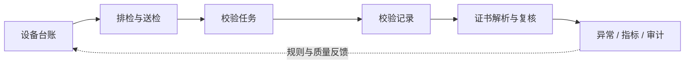

# 计量数字化管理作品集｜Measurement Portfolio

[](https://github.com/MrPerfume/measurement-portfolio/actions/workflows/verify.yml)
[](https://github.com/MrPerfume/measurement-portfolio/actions/workflows/pages.yml)

> 从计量管理员到计量数字化管理者：把设备台账、送检、证书和异常协同中的现场规则，转化为可执行、可解释、可审计的管理系统。

[进入交互演示](https://mrperfume.github.io/measurement-portfolio/) · [查看工程证据](docs/ENGINEERING_EVIDENCE.md) · [GitHub Profile](https://github.com/MrPerfume)

## 30 秒看懂

- **我解决什么**：让设备、实物、校验结果、证书和责任证据在多角色协作中保持一致。
- **我怎么判断**：从真实发生的业务事实出发；缺证据时不猜测，异常只阻断对应对象。
- **我如何落地**：把状态守卫、事务、幂等、冲突解释和审计事件沉到服务端与测试中。
- **我希望继续做什么**：设备与质量数字化管理、工业软件实施、业务梳理和产品落地。

当前为测试/演示阶段，不宣称正式生产成效。公开仓库提供脱敏交互原型、框架无关领域内核和可重复验证脚本；它不是私有完整系统的镜像。

## 先体验一个真实业务判断

[交互演示](https://mrperfume.github.io/measurement-portfolio/)使用合成数据展示四段闭环：

1. **计划外收件**：实物先到、需求未建时，正常设备继续流转，异常设备逐台留证。
2. **在检跟进**：按真实送出轮次汇总；44 天不提醒，45 天首次提醒，结果未知时停止自动重发。
3. **证书复核**：分数只负责排序；存在关键冲突或候选不唯一时，系统拒绝猜测关联。
4. **审计闭环**：重复操作不重复留痕，收件、送出、提醒、回件和复核都能回看依据。

演示全部在浏览器内存中运行：无登录、无 Cookie、无数据库、无持久化、无第三方请求，刷新页面即可恢复。

## 代表案例：计划外送检与检测方在检协同

这个案例处理的不是“再加一个送检表单”，而是现场常见的两个断点：设备已经送到，但没有预先建立需求；设备送出后，计量人员与检测方对“当前还在检什么、何时需要跟进”的理解不一致。

### 业务判断

- 以实物交接作为流程起点，先核对既有台账；未命中时保留临时身份，不猜测内部编号。
- 正常设备可批量收件，损坏或身份不符必须逐台记录，且异常只阻断对应设备。
- 收件、身份关联、协同轮次、明细和可选送出属于一个完整业务动作，不能留下半成品。
- 检测方看到的是按实际送出轮次冻结的当前在检清单，不需要理解内部对象或编号。
- 周期快照与首次达到 45 天提醒分开；结果未知时停止自动重发，确定失败才复用原投递。

### 可靠性落点

- **服务端状态守卫**：按钮只负责体验，服务在每次写动作中重新校验状态、权限与证据。
- **事务与幂等**：同键同载荷安全重放，同键异载荷拒绝；失败不留下不完整业务事实。
- **事实重新核对**：提醒重试前重新检查在检状态，设备已经回件时跳过过期提醒。
- **可解释匹配**：证书候选返回分数、依据和冲突；高分也不能越过关键身份冲突。
- **实物与证据双轴**：证书确认不等于实物回件，实物回件也不等于证书已经归档。

## 系统展示

以下图片来自隔离演示环境，全部使用合成编号、角色、月份和数量。点击可查看 1600×900 原图；图片不代表生产数据、客户背书或已确认 KPI。

<p align="center">
  <a href="assets/screenshots/01-system-overview.png">
    
  </a><br>
  <strong>统一管理概览</strong><br>
  从管理问题进入设备台账、排检监督、证书、异常和管理分析，不是单一 CRUD 菜单。
</p>

<p align="center">
  <a href="assets/screenshots/02-instrument-lifecycle.png">
    
  </a><br>
  <strong>设备全生命周期</strong><br>
  建档、位置、校验、证书、任务与异常被组织成一条可追溯业务链。
</p>

<p align="center">
  <a href="assets/screenshots/03-calibration-plan.png">
    
  </a><br>
  <strong>排检计划监督</strong><br>
  月度计划、完成进度、逾期风险和下一处理动作统一到管理视图。
</p>

<p align="center">
  <a href="assets/screenshots/04-certificate-review.png">
    
  </a><br>
  <strong>证书智能复核</strong><br>
  结构化解析、候选匹配、置信度、字段冲突和人工建议形成可解释协作。
</p>

<p align="center">
  <a href="assets/screenshots/05-submission-collaboration.png">
    
  </a><br>
  <strong>送检跨角色协同</strong><br>
  车间交接、检测方在检、回件领取与下一动作被连接成连续队列。
</p>

<p align="center">
  <a href="assets/screenshots/06-quality-governance.png">
    
  </a><br>
  <strong>异常与质量治理</strong><br>
  发现、分派、截止、重复命中、重开、复扫与关闭构成可审计闭环。
</p>

## 为什么不只是 CRUD

计量管理的难点是让不同时间、不同角色形成的事实保持一致：

- 任务只有在实际日期和结果齐备后才能完成，页面按钮不能替代服务端守卫。
- 校验结论与证书证据可能分阶段到达，后补证书不能改写已经形成的执行事实。
- 证书自动匹配必须给出分数、依据和冲突；高分、无关键冲突且候选唯一时才允许自动关联。
- 送检可以分批回件、分批领取；批次状态由明细事实推导，重复请求必须幂等。
- 关键动作形成最小审计事件，便于继续接入权限、异常治理和管理分析。



## 公开可执行内容

领域内核要求 PHP 8.3+；交互状态测试与页面发布验证使用 Node.js 24。均不连接数据库、不读取环境变量、不发起网络请求。

```bash
gh repo clone MrPerfume/measurement-portfolio
cd measurement-portfolio
bash scripts/verify.sh
```

验证脚本会执行：

- 20 项领域测试、57 个公开断言；
- 9 项交互状态边界测试；
- GitHub Pages 构建与静态引用契约；
- PHP 语法、Composer 元数据、禁止文件、秘密格式与公开 URL 白名单检查。

只构建静态站点：

```bash
bash scripts/build-pages.sh
php -S localhost:4173 -t .pages-dist
```

## 仓库导航

- [交互站点源码](site/)：语义 HTML、响应式 CSS、浏览器状态机与合成数据契约
- [领域内核](src/)：框架无关的状态守卫、匹配与回件规则
- [自动化测试](tests/)：领域失败路径与边界测试
- [架构与设计决策](docs/ARCHITECTURE.md)
- [核心业务闭环](docs/BUSINESS_FLOWS.md)
- [工程证据与验证结果](docs/ENGINEERING_EVIDENCE.md)
- [公开边界与私有映射](docs/PUBLICATION_BOUNDARY.md)
- [公开安全审计清单](docs/SECURITY_AUDIT.md)
- [许可证与数据边界](docs/LICENSE_AND_DATA_BOUNDARY.md)

## 技术边界

私有完整系统采用 Laravel 13、Filament 5、PHP 8.3、MariaDB、Docker Compose、PHPUnit、Larastan 与 Pint。公开仓库刻意只保留可独立审阅的领域规则、合成交互原型和验证方法；真实迁移、权限矩阵、通知适配器、页面源码、部署配置和运行数据均不在公开范围内。

- 所有截图、页面数据和测试标识均为合成演示数据。
- 不包含真实企业、人员、设备、证书、域名、服务器或消息目标。
- 不包含 Cookie、Token、密钥、Webhook、数据库、日志、上传或原私有 Git 历史。
- 当前许可证仅允许作品集查看与技术评估，不是开源许可证。

完整披露边界见[公开边界与私有映射](docs/PUBLICATION_BOUNDARY.md)。
