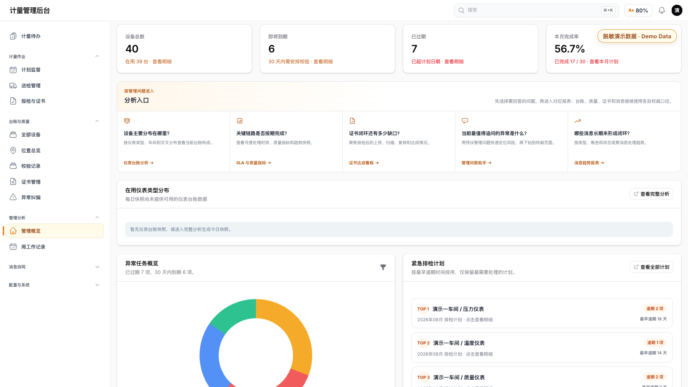

# 计量数字化管理作品集｜Measurement Portfolio

> 面向设备与质量数字化管理、工业软件实施岗位。主导现场需求、业务规则与验收，借助 AI 完成原型与测试，把跨部门协作中的问题转化为可执行流程。

[展示页](https://mrperfume.github.io/measurement-portfolio/) · [业务案例](docs/BUSINESS_FLOWS.md) · [工程证据](docs/ENGINEERING_EVIDENCE.md) · [GitHub Profile](https://github.com/MrPerfume)

**当前为本地候选版，未公开发布。** 线上仍是历史版本，以下场景直达能力待本候选发布后生效；历史 CI 不代表当前候选通过。

## 我负责什么

主导现场需求、业务规则与验收，AI 辅助代码和测试；业务判断与验收责任由我承担。把设备、实物、结果、证书与责任证据串成可追溯流程，不用按钮或匹配高分替代实际事实。当前为测试与演示阶段，不宣称生产收益、合规认证或完整系统已全面验收。

## 先体验一个案例

推荐路线：分批取回 → 查看剩余在检数量 → 查看审计记录。

| 代表案例 | 要验证的判断 | 入口（候选发布后生效） |
| --- | --- | --- |
| 同批送出，不同方式取回 | 逐台记录去向，未选设备仍在检 | [分批取回](https://mrperfume.github.io/measurement-portfolio/?scenario=returns#demo) |
| 一次报检，多次到场 | 预约不替代到场，建议不覆盖正式安排 | [周报检](https://mrperfume.github.io/measurement-portfolio/?scenario=weekly#demo) |
| 单人连续证书复核 | 匹配只是建议，关联不等于完成 | [连续复核](https://mrperfume.github.io/measurement-portfolio/?scenario=certificate#demo) |

六场景、两条分支、三个角色保持不变。详细规则、交互原型截图与原后台六图见[业务说明](docs/BUSINESS_FLOWS.md)。



## 验证与边界

历史与本轮结果分别记录在[工程证据](docs/ENGINEERING_EVIDENCE.md)和[交互验收](docs/INTERACTION_QA.md)，不累计历次测试数量。演示全部使用合成数据与浏览器内存，无登录、数据库、上传、远程接口、统计或持久化。

固定演示时刻为 2026-09-07 17:00（北京时间）；角色是分工模拟，非身份鉴权。刷新恢复初始数据并进入链接指定场景，重置恢复默认场景。

## 近期业务实践（完整系统案例说明）

2026-09-17 补充两则说明，不增加本站六场景之外的交互功能：

- [部门进度通报与预计领取安排](docs/BUSINESS_FLOWS.md#department-progress-case)：按部门隔离信息，预计时间不等于可领取；预览冻结与重复提交保护。本地模拟验证不代表真实通知已发送。
- [移动端只读排检清单](docs/BUSINESS_FLOWS.md#mobile-plan-case)：当前任务优先，明确搜索、筛选和下载范围，减少无效分页与首屏占位。不公开真实清单或签名链接；模拟手机验收不等于真机或钉钉验收。

## 一次有边界的性能案例

2026-09-05 私有本地证书页对照：应用处理中位数 **584.23ms → 430.38ms，改善约 26.3%**。同环境、相同 20 行列表，每阶段首轮单列、后五次预热样本取中位数。优化范围是局部菜单渲染，保留权限判断。

这是公开不可复现的历史自述，不是生产收益、INP、P95 或 SLA，也不包括 OCR 或真实 PDF 解析。方法与限制见[工程证据](docs/ENGINEERING_EVIDENCE.md)。


## 本地预览

在仓库根目录执行：

```bash
bash scripts/build-pages.sh
php -S localhost:4173 -t .pages-dist
```

结束按 Ctrl+C。开发工具安装、测试和截图命令见[工程说明](docs/ENGINEERING_EVIDENCE.md#本地体验与验证)。

[架构](docs/ARCHITECTURE.md) · [状态测试](site/tests/) · [端到端测试](e2e/) · [公开边界与发布准备](docs/PUBLICATION_BOUNDARY.md) · [安全核查](docs/SECURITY_AUDIT.md) · [许可证](docs/LICENSE_AND_DATA_BOUNDARY.md)

许可证仅允许作品集查看与技术评估，不是开源许可证。完整系统的身份鉴权、并发数据库、真实消息、PDF/OCR 和部署不由本原型证明。
