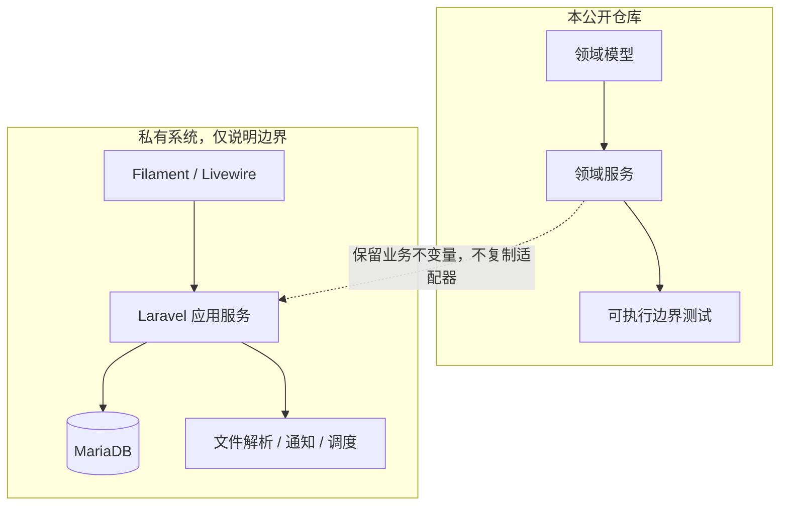

# 架构与设计决策

## 公开内核定位

私有系统是 Laravel/Filament 单体应用；作品集仓库只抽取不依赖框架的领域规则。这样可以直接运行边界测试，同时把数据库结构、页面路由、外部通知、环境配置和内部运维完全留在私有边界内。



## 领域对象

| 对象 | 公开内核中的职责 | 关键不变量 |
| --- | --- | --- |
| `CalibrationTask` | 承接计划任务与执行状态 | 未形成实际日期和结果，不得完成 |
| `CalibrationRecord` | 保存本次执行事实与后补证据 | 补证不能覆盖执行日期和结果 |
| `CertificateObservation` | 表示从证书得到的结构化字段 | 识别结果本身不产生业务副作用 |
| `InstrumentCandidate` | 表示待匹配的设备/记录候选 | 关键身份冲突必须阻断自动关联 |
| `SubmissionBatch` / `SubmissionItem` | 表示实物送检、回件和领取 | 批次状态由有效明细推导 |
| `DomainEvent` | 保存关键动作的最小审计事实 | 重放同一操作不重复产生事件 |

## 关键设计决策

### 1. 服务端状态守卫是权威边界

按钮可见性只负责体验，不负责授权或业务一致性。领域服务在每次写动作中重新校验当前状态和证据；绕过页面直接调用也不能完成非法流转。

### 2. 执行事实与证书证据解耦

现场先产生校验结论、证书后到是常见情况。因此任务完成只要求实际日期和结果，证书可后补。后补动作只填证书字段；已有证书号发生冲突时拒绝静默覆盖。

### 3. 自动匹配必须可解释

匹配结果返回：

- 总分与高/中/低等级；
- 加分依据；
- 普通冲突与关键冲突；
- 并列候选数量；
- 是否满足自动关联闸门。

本示例的自动关联条件是：分数至少 70、无关键冲突、最高分候选唯一。评分只是候选排序手段，不替代人工复核。

### 4. 实物轴与证据轴独立

证书确认不等于实物已经回件，实物回件也不等于证书已经归档。公开内核用送检批次演示物理流转，用校验记录演示证据流转，避免把两个闭环错误压成一个状态。

### 5. 幂等键同时保护重复和冲突

相同操作键、相同载荷视为安全重放；相同操作键、不同载荷视为冲突并拒绝。这样既避免网络重试制造重复记录，也不会把调用方错误悄悄吞掉。

## 私有系统中的完整分层（说明性）

```text
Filament / Livewire 页面
        ↓
Policy / Gate / Action authorize
        ↓
应用 Service（事务、幂等、审计、缓存失效）
        ↓
Eloquent 模型与 MariaDB 约束
        ↓
文件解析、调度、消息和只读集成适配器
```

公开内核没有伪装成完整系统。被省略的适配器必须在真实项目中另行覆盖授权测试、数据库事务测试、迁移回滚、外部请求伪造和浏览器验收。
