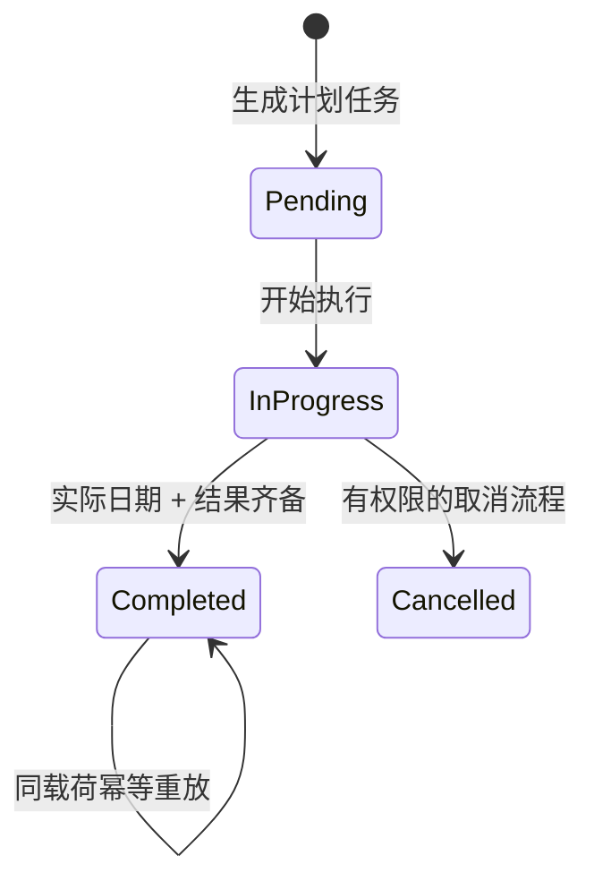
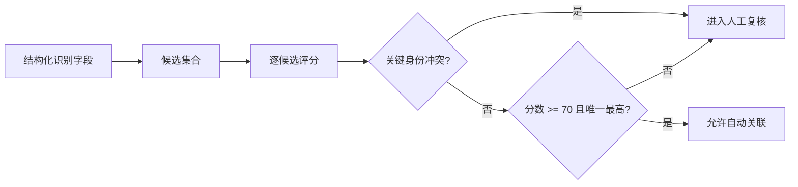
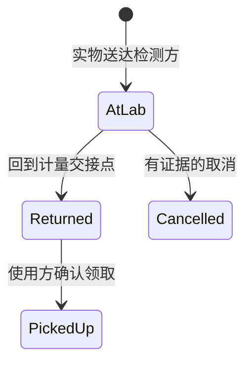

# 核心业务闭环

## 1. 排检与校验完成

规则：

1. 只有 `pending` 可以首次进入 `in_progress`。
2. 只有 `in_progress` 可以完成。
3. 实际校验日期和结果缺一不可。
4. 实际日期晚于计划日期时记录为逾期完成，但不丢失执行事实。
5. 相同完成载荷可安全重放；不同载荷不能覆盖已完成记录。
6. 后补证书只补证据字段，不改写实际日期、结果或计划日期。

对应测试：`CalibrationWorkflowTest`。

## 2. 证书候选匹配与人工复核

示例评分会综合内部编号、出厂编号、名称、规格、日期、机构和已有证书号。内部编号或已有证书号不一致属于关键冲突，即使其他字段相似也不能自动关联。

重要边界：

- “分数高”不等于“事实正确”。
- 并列最高分必须人工选择。
- 缺字段时允许输出低置信候选，但不自动写业务对象。
- 评分服务是纯计算，不读取网络、不保存记录、不完成任务。

对应测试：`CertificateMatchEvaluatorTest`。

## 3. 送检、部分回件与领取

一个批次可以包含多台设备，因此批次状态不能由单次按钮直接赋值：

- 任一有效明细仍在检测方：批次保持 `at_lab`。
- 全部有效明细已回件、但仍有待领取：批次为 `returned`。
- 全部有效明细已领取或取消：批次为 `closed`。

回件和领取都接收操作键：同键同载荷安全重放，同键不同载荷拒绝。部分回件不会把尚未回件的明细误判完成。

对应测试：`SubmissionReturnWorkflowTest`。

## 4. 私有完整系统中的外围闭环

以下能力存在于私有系统，但为控制公开面没有复制实现：

- 车间、计量和检测角色的数据范围与页面导航；
- PDF 文本提取、OCR 回退和字段映射；
- MariaDB 迁移、主数据回填和兼容字段收敛；
- 站内消息、外部通知、失败重试和调度可靠性；
- 异常工单、SLA 快照、质量评分和审计报表；
- 备份、隔离恢复、测试环境和边界层配置。

这些内容只在架构层说明，不在作品集仓库中暴露内部路径、参数、数据或运行事实。
