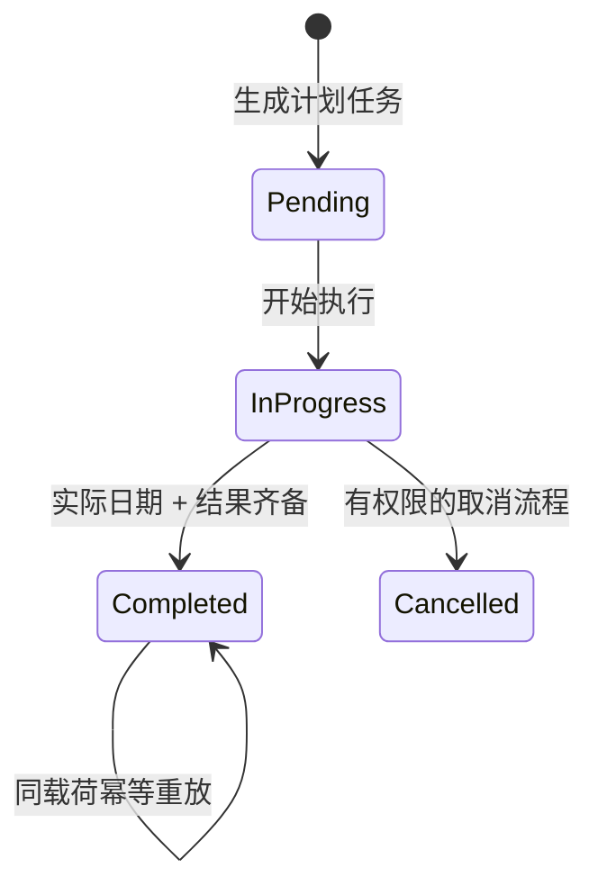
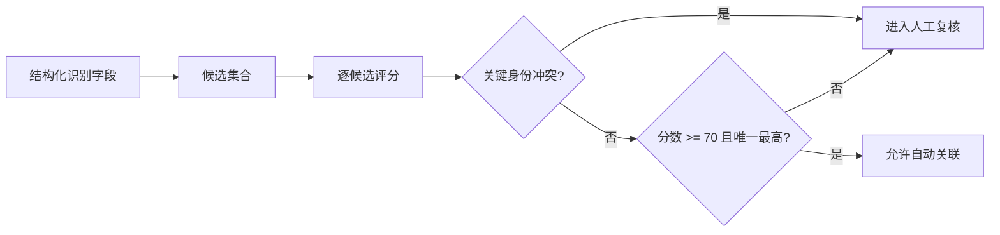
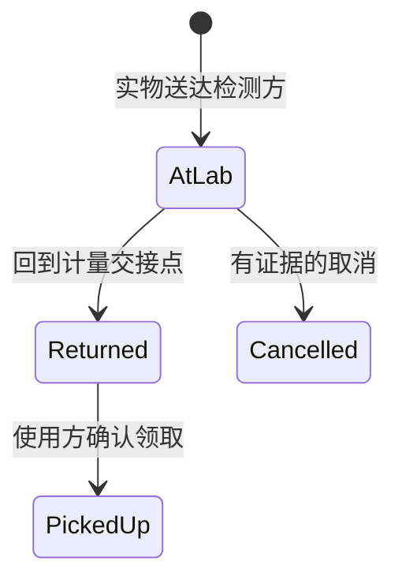
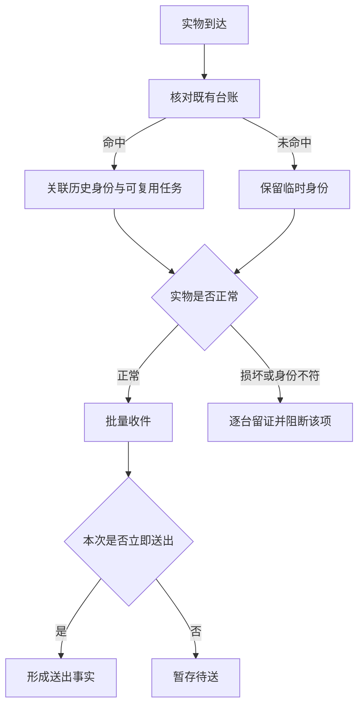
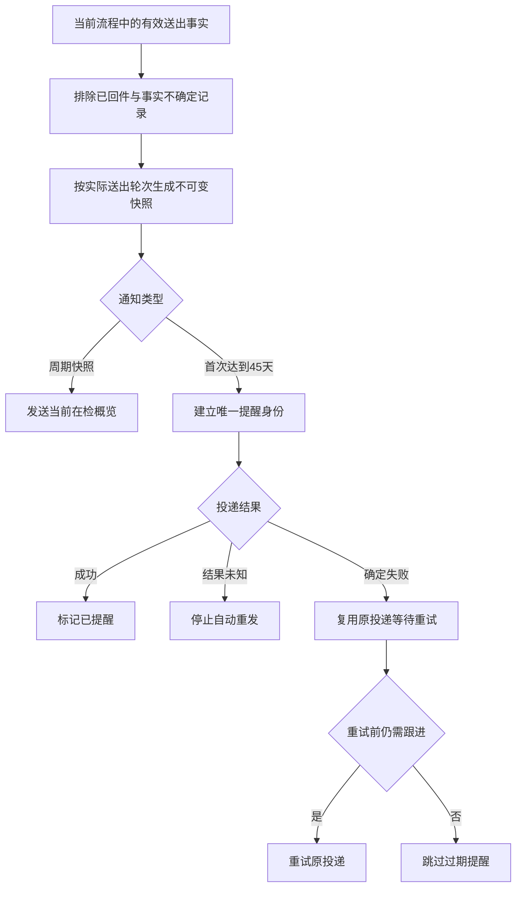

# 核心业务闭环

## 1. 排检与校验完成

规则：

1. 只有 `pending` 可以首次进入 `in_progress`。
2. 只有 `in_progress` 可以完成。
3. 实际校验日期和结果缺一不可。
4. 实际日期晚于计划日期时记录为逾期完成，但不丢失执行事实。
5. 相同完成载荷可安全重放；不同载荷不能覆盖已完成记录。
6. 后补证书只补证据字段，不改写实际日期、结果或计划日期。

对应测试：`CalibrationWorkflowTest`。

## 2. 证书候选匹配与人工复核

示例评分会综合内部编号、出厂编号、名称、规格、日期、机构和已有证书号。内部编号或已有证书号不一致属于关键冲突，即使其他字段相似也不能自动关联。

重要边界：

- “分数高”不等于“事实正确”。
- 并列最高分必须人工选择。
- 缺字段时允许输出低置信候选，但不自动写业务对象。
- 评分服务是纯计算，不读取网络、不保存记录、不完成任务。

对应测试：`CertificateMatchEvaluatorTest`。

## 3. 送检、部分回件与领取

一个批次可以包含多台设备，因此批次状态不能由单次按钮直接赋值：

- 任一有效明细仍在检测方：批次保持 `at_lab`。
- 全部有效明细已回件、但仍有待领取：批次为 `returned`。
- 全部有效明细已领取或取消：批次为 `closed`。

回件和领取都接收操作键：同键同载荷安全重放，同键不同载荷拒绝。部分回件不会把尚未回件的明细误判完成。

对应测试：`SubmissionReturnWorkflowTest`。

## 4. 计划外收件、暂存与送出

计划外场景不要求现场先补建一条虚构需求，而是从实物真实到达开始：

关键规则：

1. 既有台账身份优先复用；未建档设备只保留必要的临时身份，内部编号等待证书人工复核后确认。
2. 正常设备可以按品类批量登记；损坏或身份不符必须逐台记录证据，且只阻断对应设备。
3. 一次请求中的批次、明细、身份关联、协同轮次、收件事实和可选送出事实必须原子提交。
4. 请求标识同时承担重复点击和并发提交的幂等保护；同一请求可安全读取既有结果，不同请求不能竞争同一当前占用。
5. 历史任务关联永久保留用于追溯，只有未关闭轮次可以占用当前任务。
6. 文件先准备、业务事实后提交、成功后再消费源文件；失败只清理本轮派生文件，保留用户原始材料用于重试。
7. 服务端重新校验权限、所属范围、身份关系、检测方有效性和交接/送出时间顺序，不能只依赖页面状态。

## 5. 在检快照与首次阈值提醒

关键规则：

1. 对外快照只读取当前流程中、送出事实可证明且尚未有效回件的设备；无法证明真实送出事实的历史记录不能进入外部通知。
2. 同一需求如果分次送出，必须按实际送出轮次分别展示送出时间和在检天数，不能用原需求的最早日期覆盖后续设备。
3. 对外行只保留使用部门、设备构成、数量、送出时间、在检天数和跟进状态；内部编号、数据库标识、电话、私有路径和上传信息不进入快照。
4. 周期快照和首次达阈值提醒是两个独立事件。45 天阈值由外部通知规则冻结，不继承内部工作台可能更短的风险预警值。
5. 首次提醒以“检测方＋实际送出轮次＋阈值”形成唯一身份。同一阈值不会因为调度重复、页面重试或未知投递结果再次创建消息。
6. 结果未知不自动重发；确定失败复用原投递。每次重试前重新核对在检事实，已经全部回件时直接跳过。
7. 缺少有权留痕人、有效目的地或完整快照时失败关闭，在创建外部投递前停止。
8. 零在检只生成简短状态，不创建多余详情与媒体；媒体生成失败可以降级为文字和受限链接，但快照或访问控制失败不能继续发送。

## 6. 通知模板与路由核对

管理员核对页是只读检查入口，不是另一套配置入口：

1. 当前权威路由与兼容期旧设置分区展示，避免把历史引用误认为当前生效配置。
2. “当前可投递”必须同时满足目的地、通知设置和具体规则均启用；模板存在或被引用不等于会发送。
3. 同一事件在新旧路由中同时有效时明确提示重复投递风险。
4. 模板预览使用固定脱敏样例，只展示可能的发送效果和变量原文，不读取业务记录。
5. 查看和预览不会修改继承关系、创建消息或投递，也不会发起外部请求。

## 7. 私有完整系统中的外围闭环

以下能力存在于私有系统，但为控制公开面没有复制实现：

- 车间、计量和检测角色的数据范围与页面导航；
- PDF 文本提取、OCR 回退和字段映射；
- 数据库迁移、主数据回填和兼容字段收敛；
- 站内消息、外部通知、失败重试和调度执行器；
- 异常工单、SLA 快照、质量评分和审计报表；
- 备份、隔离恢复、测试环境和边界层配置。

这些内容只在架构层说明，不在作品集仓库中暴露内部路径、参数、数据或运行事实。
