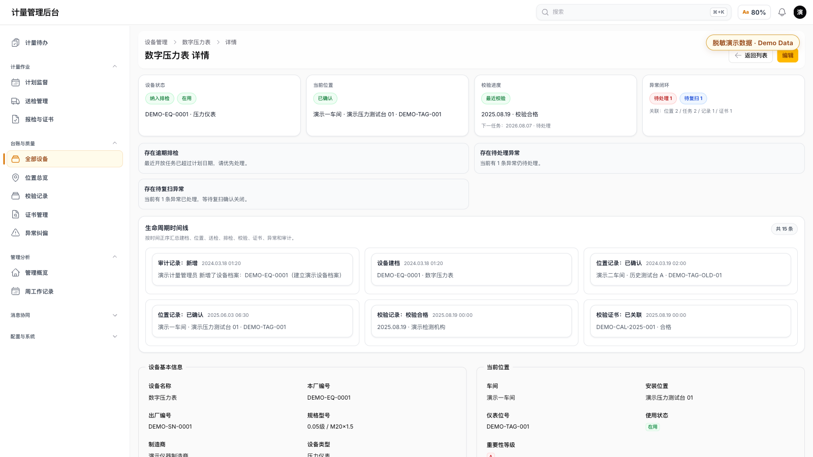
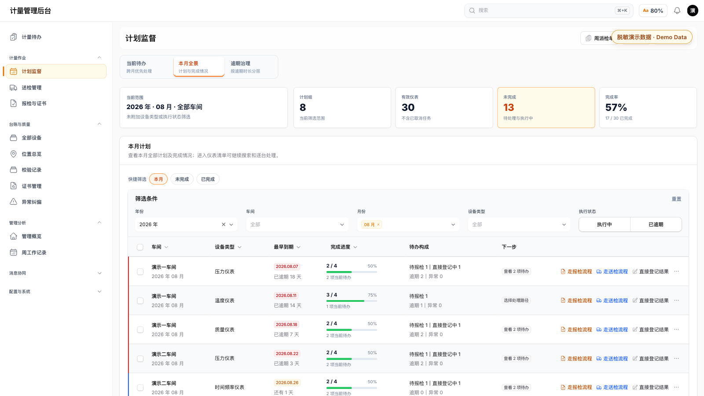
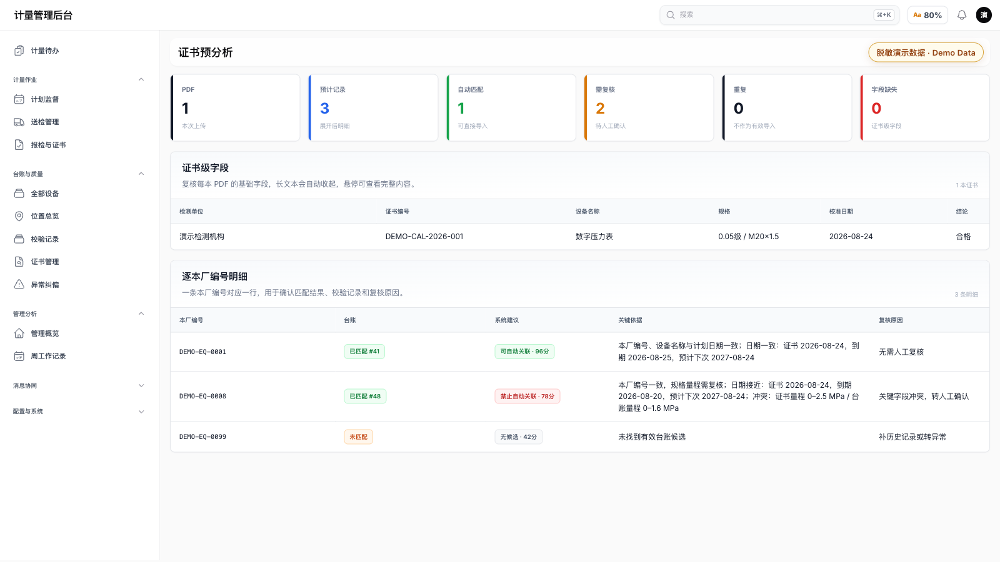
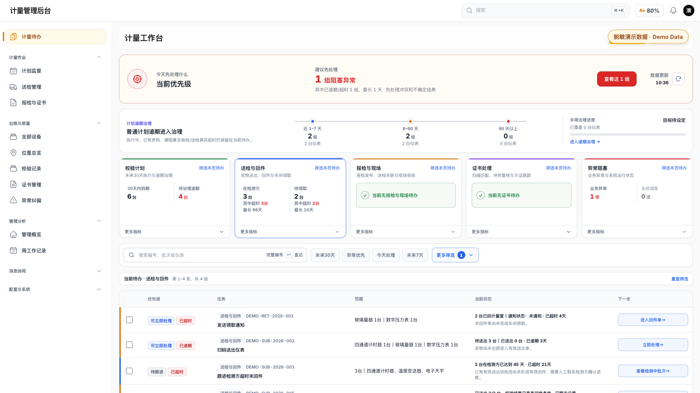
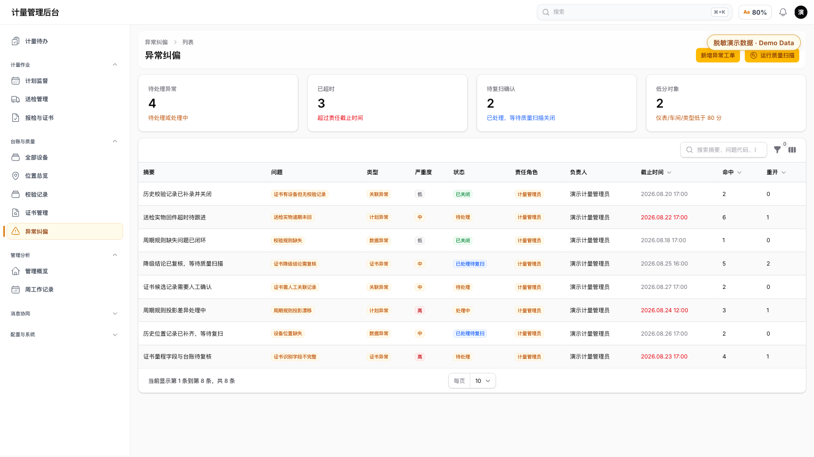

# 核心业务流程

## 六个场景，两条分支

```text
现场协同：周报检 → 排期确认 → 分次到场 → 登记结果
实物外送：计划外收件 → 在检跟进 → 分批取回 → 实际领取
                         ↘ 共用连续证书复核与审计 ↙
```

这不是六步强制串行流程。各场景有独立合成样例；跨场景产生的设备与证书引用同一份状态。默认参考时刻为 2026-09-07 17:00（北京时间），不是实时业务日期。

## 1. 周报检与分次到场

**现场问题**：一组设备报了计划，不代表同一天到齐，也不代表证书已经到达。

**业务判断**：报送、建议、正式预约、实际到场、校验结果、证书分别记录。

体验路线：

1. 计量管理员选择预置计划组，建立周单草稿，再发布并冻结范围。
2. 切换检测方选择计划组，提交排期建议；已有正式预约时改期必须写原因。
3. 切回计量管理员接受或拒绝。建议待确认、被拒绝或被替代都不覆盖原正式预约。
4. 按正式预约选择实际到场设备和时间，可分次登记；同一设备不能重复受理。
5. 显式登记所选设备的实际日期与合格/不合格结果，再载入对应合成证书。
6. 在连续复核中人工确认全部相关证书后，周单才闭环。

发布后不增删范围；已到场事实不随改期消失。预约不能自动生成到场、结果或证书，更不能生成收件、送出与领取。全部完成的周单只读。

界面先呈现本角色的当前任务：未建单不先展示零值统计；待确认建议保持展开，已处理版本可另行展开。到场表单标明正式时段与剩余设备，已到场对象转入结果登记，不再混入下一次到场选择。

## 2. 计划外收件与在检跟进

**现场问题**：实物已经到场但需求还没建立，或者后送出的设备没有出现在检测方清单。

**业务判断**：从可证明的实物事实开始，不要求补造前置需求。正常设备先接收，异常只阻断对应对象。

接收后“形成送出轮次”，新轮次立刻出现在在检与取回页面。轮次与原清单引用相同设备，分批取回后原清单、在检数量与审计同步变化。

演示中预置 44、45、66 天三个轮次：44 天不提醒，首次达到 45 天允许记录提醒；结果未知停止自动重发，已记录的不重复。提醒只是内存快照，不会发送消息；设备全部取走后不再产生过期提醒。

## 3. 分批取回与部门直领

**现场问题**：同一次送出的设备可能分批取走，且实际去向不同。

**业务判断**：逐台确认去向，不用整批状态掩盖剩余在检设备。

| 路线 | 必要输入 | 事实变化 |
| --- | --- | --- |
| 检测方 → 计量室 | 本轮设备、明确的计量室去向、有效时间 | 已回计量室，仍待领取 |
| 计量室 → 使用部门 | 已回设备、合成领取人、部门、有效时间 | 已领取 |
| 检测方 → 使用部门直领 | 本轮设备、明确的直领去向、合成领取人、部门、有效时间 | 直接已领取，不制造中间待领取事实 |

取回方式不预选。空选择、重复 ID、跨轮次设备、缺少资料、非法日期、未来或早于送出/取回的时间均被阻断。一次失败不改变任何一台设备。未选设备继续在检，两种路线可在同一轮次分批混用。交接不能补造校验结果或证书。

“登记交接”和“确认计量室领取”是两个独立表单，只显示各自可操作设备；混合状态可用任务按钮直接定位。草稿互不清除，角色/场景切换仍保留；更换轮次统一清空，避免把上一轮选择带入。提交处显示失败原因，补齐后可以重试。

## 4. 单人连续证书复核

**现场问题**：切换候选或重复确认可能覆盖旧结果；“已关联”容易被当成“已完成”。

**业务判断**：候选输入、匹配建议、确认关联、复核完成是四件不同的事。

队列预置正常、关键冲突、证据缺失和独立关联四类材料；新增周单/外送结果可载入更多合成证书。材料只展示结构化证据，不上传或解析 PDF。

1. 逐份选择候选、查看依据与冲突，执行匹配检查。
2. 高分、唯一且无关键冲突及缺证，只产生可确认建议；不能自动推进结果。
3. “仅确认关联”只关联设备，不生成独立样例的校验结果、不确认证书、不改变实物位置。
4. 勾选人工核对后，执行“确认复核并推进结果”；已有执行结果必须与证书一致，不能覆盖。
5. 成功进入下一份；失败保留输入。跳过不关闭待办，可以重新选择继续处理。
6. 返回来源定位原周单或送出轮次。独立材料明确没有来源，不伪造一条轮次。

每份证书单独保存状态。复选同一候选、切到其他候选再返回、重复确认都不重复留痕，也不清除已确认结果。

工作区优先显示当前材料，完整队列作为辅助浏览；顶部选择框可快速返回已确认、仅关联或跳过的材料。成功换份后定位新标题，失败时定位当前操作区的原因和备注，不停留在上一份的页面底部。

## 5. 审计与整体闭环

- 现场对象：执行结果完成 + 证书人工确认。
- 外送对象：执行结果完成 + 证书人工确认 + 实物已领取。
- 两个完成轴可以先后发生；先取回不等于证书已确认，先确认证书也不等于实物已领取。
- 审计记录真正发生的动作；匹配检查、角色切换和候选选择不是确认事件。
- 管理者只读，检测方提建议，计量管理员确认；切换视角保留对象、输入及处理位置。这不是身份安全机制。

## 近期业务实践：完整系统案例说明

以下为重新编写的业务判断摘要，非本站可操作功能，不改变六场景、角色或合成数据契约。验证属于私有系统的历史自述，不能由本仓库测试复现或证明真实消息送达。

<a id="department-progress-case"></a>
### 部门进度通报与预计领取安排

**现场问题**：同批设备进度不一致，跨部门通报容易混入不属于接收方的信息；预计领取时间又容易被当成已经可以领取。

**业务判断**：按部门隔离信息，把在检、已回、待领取和预计安排分别表达。预计时间不是实物事实，不能据此生成领取记录。发送前冻结预览；内容改变后需要重新核对，重复提交不重复生成投递，结果不明时先核查而不是盲目重发。

**验证与限制**：2026-09-17 本地模拟验证覆盖部门范围、预览变化和重复提交；不代表真实通知已发送。本站无消息接口、通知设置或预计领取操作，不公开接收人、群配置或内部验证资料。

<a id="mobile-plan-case"></a>
### 移动端只读排检清单

**现场问题**：手机首屏被页头和统计占满，用户难以找到当前任务；筛选后的显示范围与下载范围容易混淆。

**业务判断**：优先呈现当前任务，压缩首屏占位，保留设备、位置和位号依据。搜索与筛选明确作用于当前查阅范围，下载单独说明自身范围；只有一页时不展示无效分页，减少不必要跳转。

**验证与限制**：2026-09-17 已有浏览器桌面与模拟手机验收，不能代替真机、软键盘或钉钉内置浏览器验收。这里不提供真实清单或签名链接，也不新增交互演示；长位置文本在真实设备上的阅读仍需现场确认。

## 不在本原型中模拟

完整撤销、返工、跨周补充单、真实签名链接、并发数据库、身份鉴权、真实 PDF/OCR、消息投递和部署均不在本轮。冲突与缺证样例保留待办，不能通过一个“强制完成”按钮掩盖。既有 PHP 示例的能力见[架构](ARCHITECTURE.md)，新增流程以 JavaScript 与浏览器测试为准。

## 场景直达与浏览历史

本地候选支持 `?scenario=<标识>#demo`：`weekly`、`intake`、`lab`、`returns`、`certificate`、`audit`。首次打开使用默认计量管理员和初始合成状态；无效或缺失参数回到默认计划外收件。原首页、演示、工程证据锚点继续可用。

场景按钮更新地址，前进后退只切视图，保留当前角色、对象及草稿，不新增审计事实。URL 不携带角色、编号、表单或结果。刷新只保留指定场景，业务数据恢复初始值；重置同时清除场景参数并恢复默认场景。推荐体验入口不自动切换已有会话角色或执行交接。

两则近期实践仍是说明性案例：截至 2026-10-01 的材料包含相关只读入口测试站安装记录，但目标站登录后操作仍有待验项，不将安装等同于验收，也不推断真实通知已发送。9 月 17 日的本地模拟结果保留原日期，不更新为未经执行的新验证。

## 三张交互原型截图

- [周报检](../assets/cases/01-weekly.png)
- [双路径取回](../assets/cases/02-returns.png)
- [连续复核](../assets/cases/03-review.png)

三图为 2026-09-15 本公开原型合成数据截图；本轮未重截，不代表本轮新增导航的画面。

## 原后台合成截图（不是交互原型）

以下六张原有图片来自后台隔离演示环境，全部使用合成编号、角色、月份和数量。点击可查看 1600×900 原图；图片不代表生产数据、客户背书或已确认 KPI。

<p align="center">
  <a href="../assets/screenshots/01-system-overview.png">
    
  </a><br>
  <strong>统一管理概览</strong><br>
  从管理问题进入设备台账、排检监督、证书、异常和管理分析，不是单一 CRUD 菜单。
</p>

<p align="center">
  <a href="../assets/screenshots/02-instrument-lifecycle.png">
    
  </a><br>
  <strong>设备全生命周期</strong><br>
  建档、位置、校验、证书、任务与异常被组织成一条可追溯业务链。
</p>

<p align="center">
  <a href="../assets/screenshots/03-calibration-plan.png">
    
  </a><br>
  <strong>排检计划监督</strong><br>
  月度计划、完成进度、逾期风险和下一处理动作统一到管理视图。
</p>

<p align="center">
  <a href="../assets/screenshots/04-certificate-review.png">
    
  </a><br>
  <strong>证书智能复核</strong><br>
  结构化解析、候选匹配、置信度、字段冲突和人工建议形成可解释协作。
</p>

<p align="center">
  <a href="../assets/screenshots/05-submission-collaboration.png">
    
  </a><br>
  <strong>送检跨角色协同</strong><br>
  车间交接、检测方在检、回件领取与下一动作被连接成连续队列。
</p>

<p align="center">
  <a href="../assets/screenshots/06-quality-governance.png">
    
  </a><br>
  <strong>异常与质量治理</strong><br>
  发现、分派、截止、重复命中、重开、复扫与关闭构成可审计闭环。
</p>
